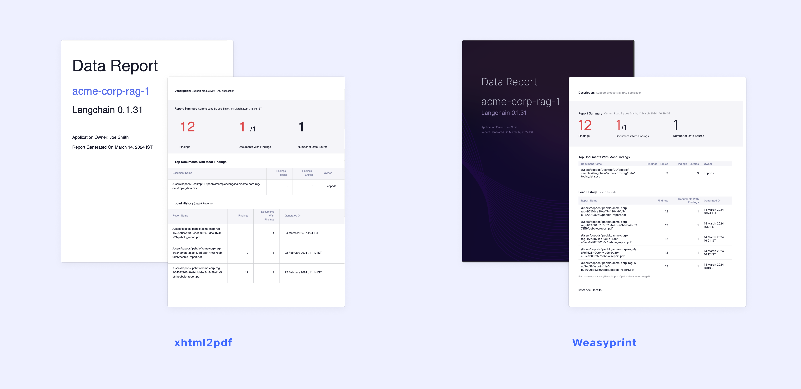

# Pebblo Configuration File

### Introduction

This configuration file specifies settings for various components of the Pebblo.

### Configuration Details

#### Server

- `port`: Specifies the port number on which the Pebblo server listens for incoming connections.
- `host`: Specifies the host address on which the Pebblo server to run.

Notes:

1. By default `Pebblo Server` runs at `localhost:8000`. When we change values of `port` and/or `host` , the `Pebblo Safe DataLoader` env variable `PEBBLO_CLASSIFIER_URL` needs to set to the correct URL.
2. By default `Pebblo UI` runs at `localhost:8000/pebblo`. When we change values of `port` and/or `host`, the Pebblo UI would be running on the respective `host:port/pebblo`.

### Logging

- `level`: Sets the logging level. Possible values are 'info', 'debug', 'error', 'warning', and 'critical'. Default value is `info`.
- `file`: Sets the log file path. Default value is `/tmp/logs/pebblo.log`.
- `maxFileSize`: Sets the maximum size of the log file. Default value is `8306688` bytes (8 MB).
- `backupCount`: Sets the number of backup files to keep. Default value is `3`.

### Reports

- `format`: Specifies the format of generated reports. Available options include 'pdf'.
- `renderer`: Specifies the rendering engine for generating reports. Options include 'weasyprint', 'xhtml2pdf'.

  > **Note**  
  >  Note: Using xhtml2pdf gives a report with basic UI elements, but WeasyPrint renderer creates a sleeker, better-aligned interface for your PDFs. See image below. If you put renderer as `weasyprint`, then you need to install Pango. Follow [these instructions](./installation.md#install-weasyprint-library) for the same.

  

- `cacheDir`: Sets the directory where pebblo stores metadata, generated reports, and other temporary files. Default value is `~/.pebblo`.
- `anonymizeSnippets`: Flag to anonymize snippets in report and Pebblo local UI. Possible values are 'True' and 'False'. When its value is 'True', snippets in reports and Pebblo local UI will be shown as anonymized and vice versa.
- `outputDir`: Deprecated. Use `cacheDir` instead.

### Classifier

- `mode`: Specifies mode for classify API. Possible values are `all`, `entity` or `topic`. Default value is `all`. When its value is `all`, both entities and topics will get classified, if value is `entity`, only entities will get classified and vice-versa. It is used for classification in /classify and /loader/doc APIs.
- `anonymizeSnippets` is deprecated, use 'anonymizeSnippets' in reports instead.

### Storage
This is beta feature introduced in 0.1.18.
- `type`: Specifies storage type to store states of the GenAI applications. Possible values are `file` or `db`.  Default value is `file`. By default, SQLite database is used when we set it as `db`.
- `type` as `file` is deprecated, use `type` as `db`. `file` would not be supported from 0.1.19 release.

### Default Configuration

```yaml
daemon:
  port: 8000
  host: localhost
logging:
  level: info
reports:
  format: pdf
  renderer: xhtml2pdf
  outputDir: ~/.pebblo
  anonymizeSnippets: False
classifier:
  mode: all
storage:
  type: file
```

`Note`:
Users have the option to maintain any section or even a single field within a section. For instance, the `config` file might appear as follows:

```yaml
logging:
  level: info
```

This flexibility empowers users to tailor configurations to their specific needs while retaining default values for other sections or fields.


