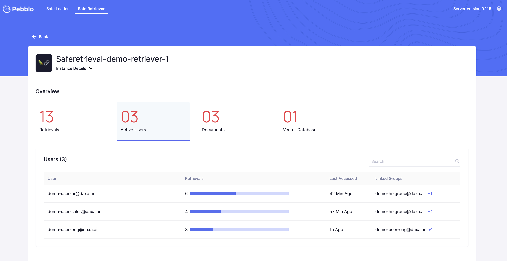

# Pebblo UI

Pebblo UI provides an in-depth visibility into the document ingested into Gen-AI RAG applications during every load.

Pebblo server now listens to `localhost:8000` to accept Gen-AI application data snippets for inspection and reporting.
Pebblo UI interface would be available on `http://localhost:8000/pebblo`

This document describes the information displayed on the interface.

# Overview Page

This page consist of 4 primary tabs that provides the following details:

1. **Applications With Findings**:
   The number signifies the proportion of applications with findings out of the total active applications. Additionally, it will present you with a detailed list of these applications, including the count of findings (Topics + Entities), the name of the owner, and the option to download the PDF report for each application.

2. **Findings**:
   The figure denotes the cumulative count of Topics and Entities identified across all applications. It will also furnish you with a comprehensive list of these Topics and Entities, along with supplementary information including the count of source files they originate from, the Datasource, and the name of the Application.

3. **Files with Findings**:
   The number of files that has one or more Findings over the total number of files used in document load across all the applications. This field indicates the number of files that need to be inspected to remediate any potentially text that needs to be removed and/or cleaned for Gen-AI inference.

   It will also provide you with a list of these files, accompanied by additional details such as the file size, the owner's name, the count of topics & entities within each file, and the name of the Datasource.

4. **Datasource**:
   The number of data sources used to load documents into the Gen-AI RAG applications. For e.g. this field will be two if a RAG application loads data from two different directories or two different AWS S3 buckets.

   It will also provide you with a list of these Datasource, accompanied by additional details such as the size, source path, the count of topics & entities across the datasource, and the Application they are associated with.

# Application Details Page

You will be directed to the application details page by clicking on any application from the list available in the `Applications With Findings` tab in overview page.

**Instance Details**:
This section provide a quick glance of where the RAG application is physically running like in a Laptop (Mac OSX) or Linux VM and related properties like IP address, local filesystem path and Python version.

**Download Report**:
Can download the data report of the application in PDF format.

**Load History**:
The table provides the history of findings and path to the reports for the previous loads of the same RAG application.

Load History provides details about latest 5 loads of this app. It provides the following details:

1. **Report Name** - The path to the report file.
2. **Findings** - The number of findings identified in the report.
3. **Files With Findings** - The number of files containing findings.
4. **Generated On** - The timestamp, when the report was generated. Time would be in local time zone.

**Report Summary**: Report Summary has 4 primary tabs:

1. **Findings**: The figure denotes the cumulative count of Topics and Entities identified in the application. It will also furnish you with a comprehensive list of these Topics and Entities, along with supplementary information including the count of source files they originate from, and the Datasource name.

2. **Files with Findings**: The number of files that has one or more Findings over the total number of files used in document load across the application. This field indicates the number of files that need to be inspected to remediate any potentially text that needs to be removed and/or cleaned for Gen-AI inference.

   It will also provide you with a list of these files, accompanied by additional details such as the file size, the owner's name, the count of topics & entities within each file, and the name of the Datasource.

3. **Datasource**: The number of data sources used to load documents into the Gen-AI RAG applications. For e.g. this field will be two if a RAG application loads data from two different directories or two different AWS S3 buckets.

   It will also provide you with a list of these Datasource, accompanied by additional details such as the size, source path, the count of topics & entities across the datasource.

4. **Snippets**: This sections provides the actual text inspected by the Pebblo Server using the Pebblo Topic Classifier and Pebblo Entity Classifier. This will be useful to quickly inspect and remediate text that should not be ingested into the Gen-AI RAG application. Each snippet shows the exact file, the snippet is loaded from easy remediation, all the sensitive info labeled with confidence score(HIGH, MEDIUM and LOW).
