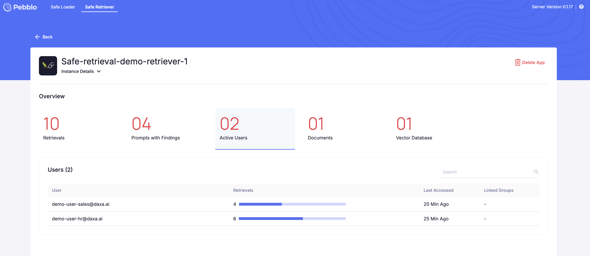

# Safe Retriever Tab

This section provides details about the retrievals for all the retrieval based application.

## Overview Page

This page consist of 5 primary tabs that provides the following details:

1. **Applications**:
   The number signifies total number of retrieval type applications.

   The below section lists all retrieval type applications along with details like Application Name, Owner, Retrievals i.e. cumulative count of retrievals, Active Users, Documents, VectorDBs.

2. **Retrievals**:
   The figure denotes the cumulative count of retrievals happened for all the apps.

3. **Prompts with Findings**:
   The number of prompts that has one or more findings over the total number of prompts used during retrieval process. This field indicates the number of prompts that need to be inspected for Gen-AI inference.

4. **Active Users**:
   The number of active users for all the retrieval type applications.

5. **Violations**:
   Coming Soon!

## Application Details Page

You will be directed to the application details page by clicking on any application from the list available in the `Application` tab in overview page.

**Instance Details**:
This section provide a quick glance of where the RAG application is physically running like in a Laptop (Mac OSX) or Linux VM and related properties like IP address, local filesystem path and Python version.

This page consist of 5 primary tabs that provides the following details:

1. **Retrievals**: The figure denotes the cumulative count of retrievals happened for this app.
   This section provides details about all retrievals with information like

   **Prompt** : What was the prompt sent by the end user, Who sent the prompt and when it was sent.

   **Findings**: One or more key findings extracted from the prompt.

   **Context** : What was the context and which vector db was used.

   **Response**: This is the final response generate by LLM for the given prompt.

   **Retrieved From** : Source file of this context.

2. **Prompts with Findings**: The number of prompts that has one or more findings over the total number of prompts for the given application.

3. **Active Users**: The number of active users for this application will be provided, accompanied by a list of these users. This list will include additional details such as the retrieval count for each user and the last time they accessed the application.

4. **Documents**: The number of documents accessed for retrievals will be provided, accompanied by a list of these documents. This list will include supplementary details such as the owner's name, retrieval count for each document, and the most recent access time for information from each document.

5. **Vector Databases**: The number of vector databases used in retrievals for this application.
   Details within this tab are coming soon.

## Prompt With Findings Details Page

This page shows all the prompt with findings for all the applications.

1. **Entity Name**: The name of the entity which is present in the prompts.
2. **Prompts**: Number of prompts in which the entity was detected.
3. **Users**: Users who have used this entity in the prompt.
4. **Apps** : Application in which the entity is present.